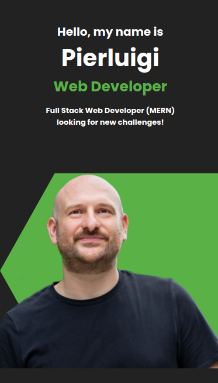
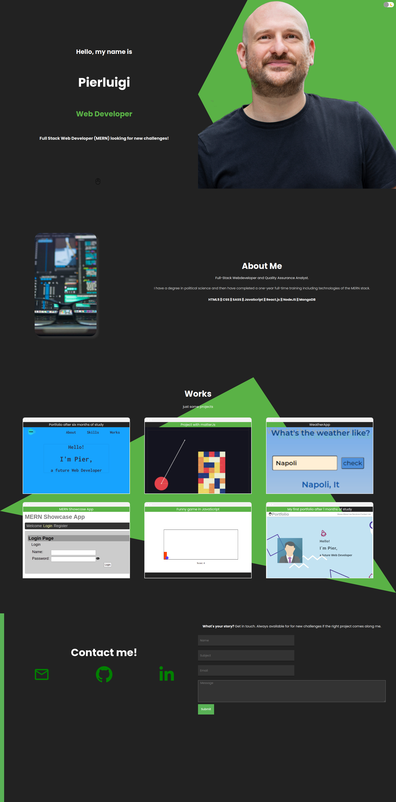

# Portfolio - Pierluigi

This my portifolio made with Reactjs, JavaScript, SAAS and Emailjs.

<br />

### Web deploy:


<br />

>Mobile Version



<br />


>Desktop Version



<br />
<br />

## How to install:

> $ git clone "project" <br />
> $ cd "project" <br />
> $ npm install <br />
> $ npm start <br />

<br />


### Structure

```
portfolio
 │
 │─── public
 │─── src
 │     │
 │     │─── components
 │     │     │─── intro
 │     │     │      │─── Intro.js
 │     │     │      └─── intro.scss
 │     │     │─── about
 │     │     │      │─── About.js
 │     │     │      └─── about.scss
 │     │     │─── project
 │     │     │      │─── Project.js
 │     │     │      └─── project.scss
 │     │     │─── projectList
 │     │     │      │─── ProjectList.js
 │     │     │      └─── projectList.scss
 │     │     │─── contact
 │     │     │      │─── Contact.js
 │     │     │      └─── contact.scss
 │     │     └─── toggle
 │     │            │─── Toggle.js
 │     │            └─── toggle.scss
 │     │ 
 │     │─── images  
 │     │─── App.js    
 │     │─── context.js
 │     │─── data.js
 │     └─── index.js
 │ 
 │─── .gitignore
 │─── .env.sample
 │─── package-lock.json
 │─── package.json
 └─── README.md
 
```

<br />
